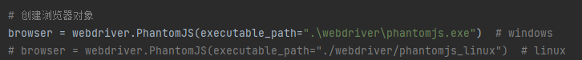

# isbn_search

本项目基于python3，实现通过书籍的isbn码查询书籍信息的功能。

项目链接：[https://github.com/vistar-terry/isbn_search](https://github.com/vistar-terry/isbn_search)

相关博客链接：[Python爬虫实现isbn查询豆瓣书籍详细信息](https://blog.csdn.net/maizousidemao/article/details/102532075)

如有疑问，欢迎提 [issues](https://github.com/vistar-terry/isbn_search/issues) ，或在博客评论区留言。


### 一、目录说明

1. book.py：脚本文件
2. requirements.txt：依赖环境版本
3. webdriver：浏览器驱动


### 二、使用说明

#### 1. 安装环境

在项目根目录执行以下命令，安装项目所需环境：

```bash
pip install -r requirements.txt
```


#### 2. 确认浏览器驱动路径

`book.py` 代码中的



需要根据使用的系统平台选择相应的浏览器驱动，其中 `executable_path` 是驱动路径。

其中，由于linux浏览器驱动大小超过了github单个文件50MB的限制，使用时需要先解压。


#### 3. 快速测试

在 `book.py` 同级目录执行以下命令：

```bash
python book.py 9787121369421
```

输出如下：


### 三、注意

需要注意以下两点：

- ##### a. 为便于快速测试，浏览器驱动路径默认以`book.py`为参考的相对路径

​	也就是说需要在 `book.py` 同级目录执行 `python book.py 9787121369421` 命令，如需在其他路径执行，可以将驱动路径加到系统环境变量中。

- ##### b. 如将驱动路径加到系统环境变量中，上述浏览器驱动路径代码要修改为如下形式：

```python
# 创建浏览器对象
browser = webdriver.PhantomJS()  # windows
# browser = webdriver.PhantomJS()  # linux
```

项目使用 `phantomjs` ，目前只测试了 `windows(win10/win11)` 和 `linux(Ubuntu20.04)` 系统，其他系统的 `phantomjs` 可以去主页下载 [https://phantomjs.org/download.html](https://phantomjs.org/download.html) ，但不保证可以使用。


### 四、TO DO

1. 优化查询效率
2. 使用Chrome或Firefox浏览器


### 五、交流讨论


